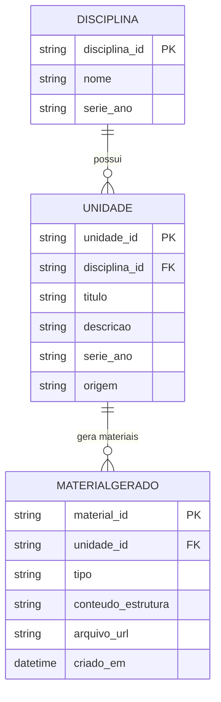

### Modelo Entidade-Relacionamento (ERD) — Cultura Digital

Este documento descreve o modelo entidade-relacionamento lógico do sistema Cultura Digital, alinhado aos requisitos funcionais (RF), histórias de usuário (HU) e casos de uso (UC) definidos em `docs/`.

O foco é representar os dados centrais do sistema web single-user (sem autenticação), não a base de conhecimento do RAG (BNCC/MEC), que é tratada como fonte externa especializada.

---

### Entidades principais

**Disciplina**  
Representa a disciplina cadastrada pelo professor.

- `disciplina_id` (PK)
- `nome`
- `serie_ano` — série/ano escolar associado

Relacionamentos:

- Uma disciplina **possui muitas** unidades de ensino.

Vínculos:

- RF01 — Cadastro e gerenciamento de disciplinas
- HU01, HU02, HU03
- UC01 — Gerenciar disciplinas

---

**Unidade**  
Representa uma unidade de ensino (aula) dentro de uma disciplina.

- `unidade_id` (PK)
- `disciplina_id` (FK → Disciplina)
- `titulo` — tema da aula
- `descricao` — descrição opcional da unidade
- `serie_ano` — série/ano alvo (reforça o vínculo pedagógico)
- `origem` — `manual` ou `ia` (identifica se foi criada pelo professor ou sugerida via RAG)

Relacionamentos:

- Uma unidade **pertence a** uma disciplina.
- Uma unidade **pode possuir** um ou mais materiais gerados (plano, atividade, slides).

Vínculos:

- RF02 — Criação manual de unidades (aulas)
- RF03 — Sugestão automática de unidades via IA
- HU04, HU05
- UC02 — Criar unidade manualmente
- UC03 — Sugerir unidades via IA

---

**MaterialGerado**  
Representa qualquer material produzido pela IA para uma unidade.

- `material_id` (PK)
- `unidade_id` (FK → Unidade)
- `tipo` — `PLANO`, `ATIVIDADE`, `SLIDES`
- `conteudo_estrutura` — representação estruturada (JSON/texto) armazenada no sistema
- `arquivo_url` — caminho ou URL para download (quando houver arquivo gerado, ex.: PDF/DOCX)
- `criado_em`

Relacionamentos:

- Um material gerado **pertence a** uma unidade.

Vínculos:

- RF04 — Geração automática de plano de aula
- RF05 — Geração automática de atividade avaliativa
- RF06 (Opcional) — Geração de slides de apoio
- HU06, HU07, HU08
- UC04 — Gerar plano de aula
- UC05 — Gerar atividade avaliativa
- UC06 — Gerar slides (opcional)

---

### Entidades de suporte (lógicas)

Embora o sistema seja single-user e não exija autenticação, algumas entidades aparecem de forma lógica na arquitetura, mas não necessariamente como tabelas físicas em banco relacional:

**SessaoLocal** (conceitual)  
Representa o estado local do professor durante o uso (disciplinas e unidades armazenadas em localStorage/IndexedDB). Não é persistida em servidor.

- Armazena coleções de `Disciplina` e `Unidade` apenas no navegador.

**DocumentoBNCC** (conceitual para o RAG)

- Representa documentos e trechos da BNCC/MEC usados pelo LlamaIndex.
- Fica fisicamente sob responsabilidade do serviço RAG em `/rag` (por exemplo, `data/BNCC_completa.pdf` e o índice vetorial em `storage/`).
- Mantido aqui apenas para contexto arquitetural, não como parte do modelo transacional do front.

---

### Diagrama ERD (Mermaid)

Observações:

- O campo `origem` em `UNIDADE` permite distinguir unidades criadas diretamente pelo professor daquelas sugeridas pelo RAG com Llama.
- O campo `tipo` em `MATERIALGERADO` permite tratar plano de aula, atividade avaliativa e slides como variações de uma mesma entidade, simplificando o modelo.
- O atributo `conteudo_estrutura` representa a saída estruturada enviada pelo serviço RAG (por exemplo, JSON de plano ou atividade) antes da geração opcional de arquivos.

---

### Rastreabilidade com RF / HU / UC

- **DISCIPLINA**
  - RF01 — Cadastro e gerenciamento de disciplinas
  - HU01, HU02, HU03
  - UC01 — Gerenciar disciplinas

- **UNIDADE**
  - RF02 — Criação manual de unidades (aulas)
  - RF03 — Sugestão automática de unidades via IA
  - HU04, HU05
  - UC02 — Criar unidade manualmente
  - UC03 — Sugerir unidades via IA

- **MATERIALGERADO**
  - RF04 — Geração automática de plano de aula
  - RF05 — Geração automática de atividade avaliativa
  - RF06 (Opcional) — Geração de slides de apoio
  - HU06, HU07, HU08
  - UC04 — Gerar plano de aula
  - UC05 — Gerar atividade avaliativa
  - UC06 — Gerar slides (opcional)

Este ERD está alinhado à visão geral de arquitetura em `docs/ARQUITETURA.md` e ao papel da IA descrito no README e no edital, mantendo o modelo de dados simples e suficiente para o escopo single-user do hackathon.