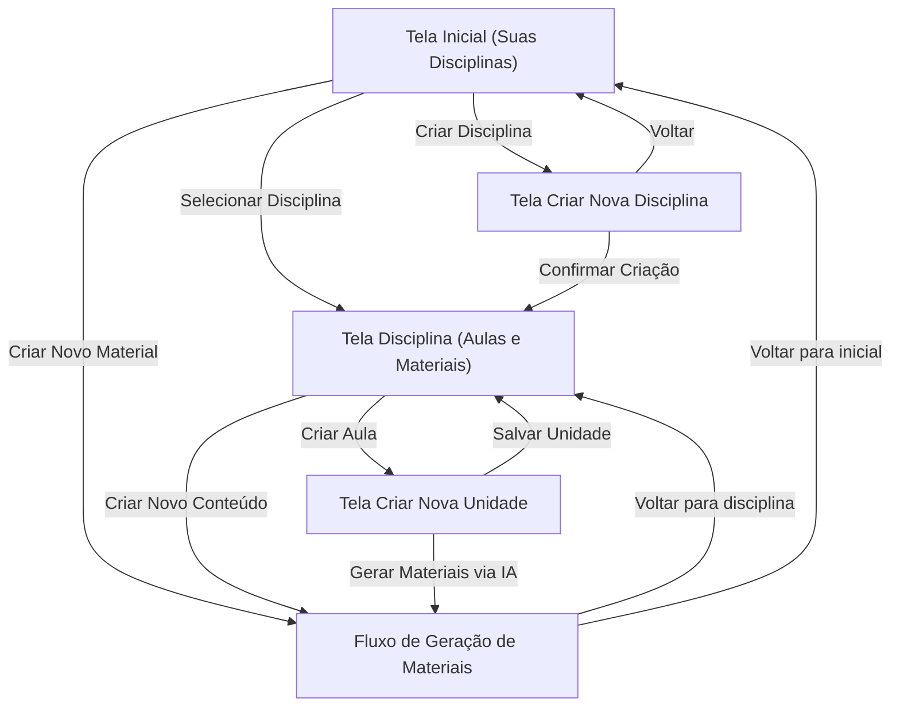

### Telas e Responsabilidades — Cultura Digital

Este documento descreve as principais telas do sistema Cultura Digital, suas responsabilidades e a relação com RF, HU, UC e entidades do modelo de dados.

As telas são implementadas no frontend em `/src` (SPA) e consomem o serviço de RAG em `/rag` quando necessário.

---

### Tela 1 — Inicial (Suas Disciplinas)

**Descrição**  
Tela principal após abrir o sistema. Apresenta a identidade "Cultura Digital", uma saudação ao professor e a lista de disciplinas cadastradas.

**Responsabilidades principais**

- Exibir todas as disciplinas cadastradas pelo professor.
- Permitir criar uma nova disciplina.
- Servir como ponto de partida para acessar a página de cada disciplina.
- Exibir um resumo simples de materiais/gerações recentes (histórico básico).

**Relação com RF / HU / UC**

- RF01 — Cadastro e gerenciamento de disciplinas.  
- HU01, HU02, HU03.  
- UC01 — Gerenciar disciplinas.  

**Relação com entidades**

- `DISCIPLINA` — lista de disciplinas exibida.  
- `MATERIALGERADO` — opcionalmente, itens mais recentes no histórico.  

**Ponto na arquitetura**

- Implementada em `src/features/disciplinas/ui.tsx` (ou rota principal em `src/app/routes.ts` usando esta feature).
- Usa serviços de `features/disciplinas/services` e storage local (`disciplinaStorage`).

---

### Tela 2 — Criar Nova Disciplina

**Descrição**  
Formulário para cadastrar uma nova disciplina, escolhendo série/ano e o nome da disciplina.

**Responsabilidades principais**

- Receber os dados da nova disciplina (série/ano, nome).
- Validar campos obrigatórios.
- Persistir a nova disciplina no armazenamento local.
- Redirecionar para a página da disciplina recém-criada ou para a tela inicial.

**Relação com RF / HU / UC**

- RF01 — Cadastro e gerenciamento de disciplinas.  
- HU01 — Cadastrar disciplina.  
- UC01 — Gerenciar disciplinas.  

**Relação com entidades**

- `DISCIPLINA` — criação de um novo registro.  

**Ponto na arquitetura**

- Implementada em `src/features/disciplinas/ui.tsx` (subcomponente ou rota dedicada `/disciplinas/nova`).
- Usa `features/disciplinas/services` e `disciplinaStorage`.

---

### Tela 3 — Página da Disciplina (Aulas e Materiais)

**Descrição**  
Tela de gestão de uma disciplina específica. Mostra as unidades (aulas) daquela disciplina, materiais já gerados e atividades recentes.

**Responsabilidades principais**

- Exibir informações da disciplina selecionada (nome, série/ano).
- Listar unidades associadas à disciplina.
- Listar materiais gerados para as unidades (plano, atividade, slides).
- Permitir criar nova unidade.
- Permitir iniciar a geração de novos materiais para a disciplina/unidades.

**Relação com RF / HU / UC**

- RF01 — Visualizar disciplina e seus dados.  
- RF02 — Acesso à criação manual de unidades.  
- RF03 — Ponto de entrada para sugestões de unidades via IA (quando houver).  
- RF04, RF05, RF06 — Acesso à geração de materiais.  
- HU04, HU05, HU06, HU07, HU08.  
- UC02 — Criar unidade manualmente.  
- UC03 — Sugerir unidades via IA.  
- UC04, UC05, UC06 — Gerar materiais para a disciplina/unidades.  

**Relação com entidades**

- `DISCIPLINA` — disciplina atualmente selecionada.  
- `UNIDADE` — lista de unidades da disciplina.  
- `MATERIALGERADO` — materiais gerados vinculados às unidades.  

**Ponto na arquitetura**

- Implementada em `src/features/unidades/ui.tsx` combinada com `features/materiais/ui.tsx` (ou rota `/disciplinas/:disciplinaId`).
- Usa serviços de `features/unidades/services` e `features/materiais/services`.

---

### Tela 4 — Criar Nova Unidade

**Descrição**  
Formulário para criação manual de uma unidade (aula) dentro de uma disciplina. Permite informar tema, contexto e acionar geração de materiais via IA.

**Responsabilidades principais**

- Receber dados da nova unidade (tema, contexto, série/ano quando necessário).
- Salvar a unidade associada à disciplina atual.
- Oferecer botões para gerar plano de aula, atividade e slides a partir da unidade e do contexto.

**Relação com RF / HU / UC**

- RF02 — Criação manual de unidades (aulas).  
- RF03 — Ponto de entrada para unidades sugeridas, quando integrado ao RAG.  
- RF04, RF05, RF06 — Geração de materiais a partir da unidade.  
- HU04, HU05, HU06, HU07, HU08.  
- UC02 — Criar unidade manualmente.  
- UC03 — Sugerir unidades via IA (quando houver).  
- UC04, UC05, UC06 — Gerar materiais para a unidade.  

**Relação com entidades**

- `UNIDADE` — criação de novo registro com `origem = manual` (ou `ia` se vier de sugestão).  
- `MATERIALGERADO` — materiais gerados a partir desta unidade.  

**Ponto na arquitetura**

- Implementada em `src/features/unidades/ui.tsx` (rota `/disciplinas/:disciplinaId/unidades/nova`).
- Usa `features/unidades/services` para salvar a unidade e `features/materiais/services` para chamar o RAG.

---

### Tela 5 — Fluxo de Geração de Materiais (Plano, Atividade, Slides)

**Descrição**  
Tela ou conjunto de telas responsáveis por acionar o RAG para gerar plano de aula, atividade avaliativa e slides, a partir de uma unidade selecionada.

**Responsabilidades principais**

- Receber parâmetros da unidade (disciplina, série/ano, tema, contexto).
- Permitir escolher que tipo de material gerar (plano, atividade, slides).
- Exibir progresso/feedback enquanto a IA gera o conteúdo.
- Exibir o material gerado (ou link de download de arquivo PDF/DOCX).
- Registrar o material gerado para aparecer nas telas da disciplina e no histórico.

**Relação com RF / HU / UC**

- RF03 — Sugestão automática de unidades via IA (quando fluxo incluir sugestões).  
- RF04 — Geração automática de plano de aula.  
- RF05 — Geração automática de atividade avaliativa.  
- RF06 — Geração de slides de apoio (opcional).  
- HU05, HU06, HU07, HU08.  
- UC03, UC04, UC05, UC06.  

**Relação com entidades**

- `UNIDADE` — unidade para a qual o material está sendo gerado.  
- `MATERIALGERADO` — registro criado a partir da resposta do serviço RAG.  

**Ponto na arquitetura**

- Implementada em `src/features/materiais/ui.tsx` (por exemplo, rota `/materiais/:unidadeId`).
- Usa `features/materiais/services` (que, por sua vez, chamam `features/rag/services`).
- Integra com o backend `/rag` (FastAPI + LlamaIndex) para geração dos conteúdos.

---

### Visão geral de navegação

De forma resumida, o fluxo entre as telas é:

Essa visão de telas complementa `docs/ARQUITETURA.md`, `docs/ADR.md`, `docs/ERD.md`, `docs/RF.md`, `docs/HU.md` e `docs/UC.md`, garantindo rastreabilidade entre requisitos, modelo de dados, arquitetura técnica e experiência do usuário.

